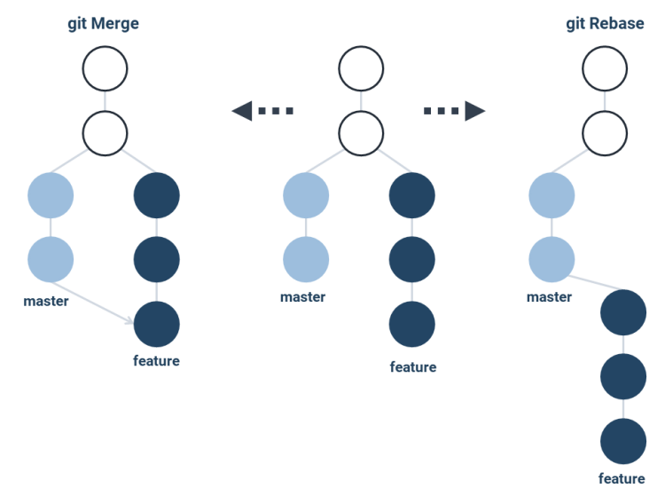

#Git Rebase

Git rebase est une commande utilisée pour intégrer les modifications d'une branche sur une autre branche en réécrivant l'historique. Contrairement à la fusion (merge), qui crée un nouveau commit de fusion, le rebase déplace les commits de la branche actuelle au-dessus de la branche cible.

L'avantage du rebase est qu'il produit un historique linéaire et plus propre, car les commits de la branche actuelle semblent avoir été appliqués directement sur la branche cible. Cela facilite la lecture de l'historique et la résolution des conflits.

