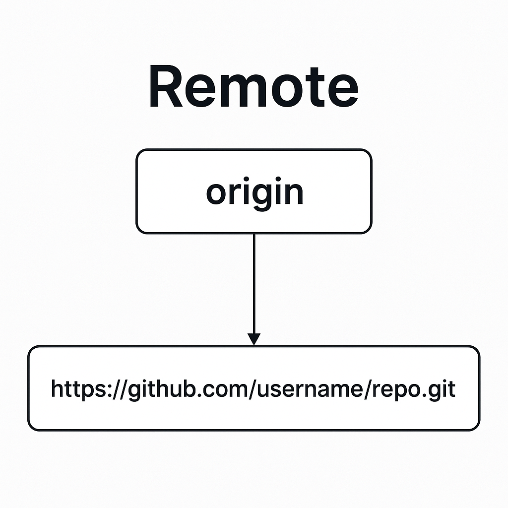

# Remote Explained

Généralement, vous vous occupez de créer votre **remote** lorsque vous commencez votre projet, mais vous avez peu souvent besoin de configurer celles-ci.

### The remote is the reference (a shortcut name, like origin) that points to the URL of a repository




Vous pouvez aussi avoir plusieurs remotes.  
Par exemple :
- Une remote pour envoyer le code vers **GitHub**.
- Une autre pour envoyer le code vers votre hébergeur de site web (par exemple **Heroku** ou **Fly.io**).

---

## Gestion des remotes

### ➕ Ajouter une remote
```bash
git remote add <nom_remote> <URL_remote>
```
Cette commande ajoute une nouvelle remote avec un nom spécifié et une URL associée.  

Exemple :
```bash
git remote add origin https://github.com/JohnDoeCourse/MyRepo.git
```
👉 Ajoute une remote appelée **origin** liée à l'URL du dépôt distant.

---

### 📋 Afficher la liste des remotes
```bash
git remote
```
Affiche la liste de toutes les remotes configurées dans votre dépôt local.  

```bash
git remote -v
```
Affiche la liste des remotes **avec les URL correspondantes**.

---

### ✏️ Renommer une remote
```bash
git remote rename <ancien_nom> <nouveau_nom>
```
Renomme une remote existante.  

Exemple :
```bash
git remote rename origin new-origin
```
👉 Renomme la remote **origin** en **new-origin**.

---

### ❌ Supprimer une remote
```bash
git remote remove <nom_remote>
```
Supprime la remote spécifiée du dépôt local.  

Exemple :
```bash
git remote remove origin
```
👉 Supprime la remote **origin**.

---
